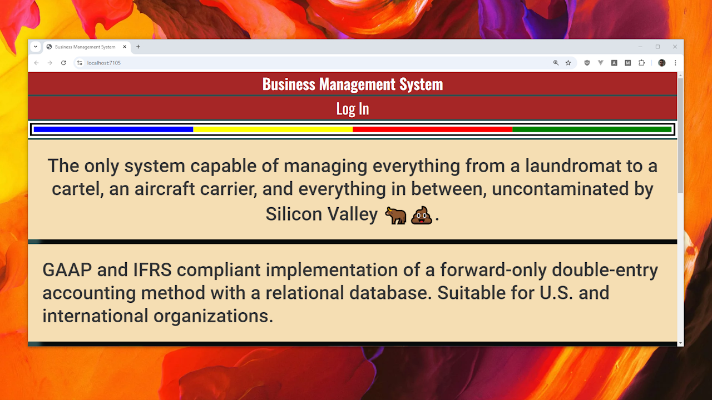
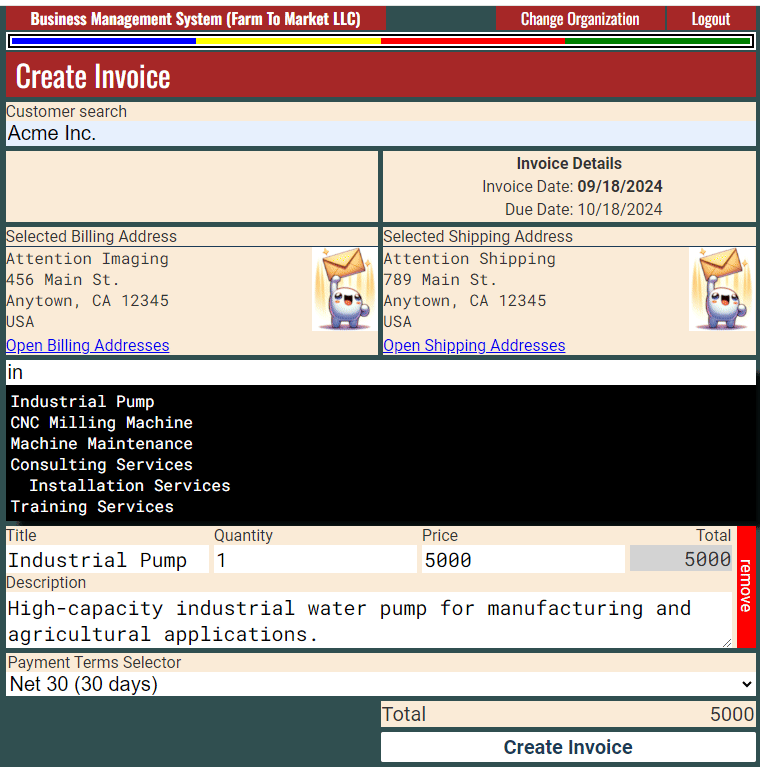
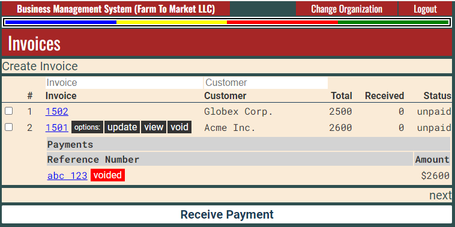
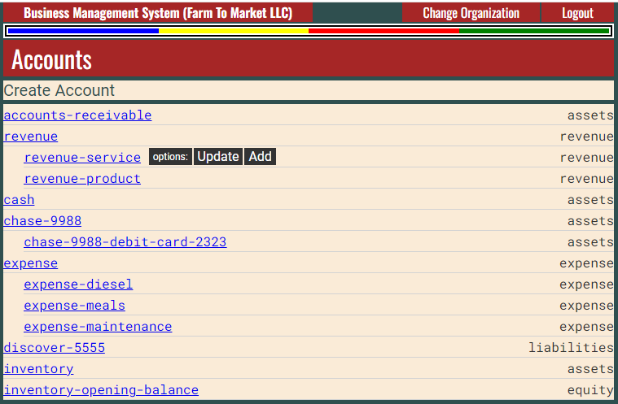
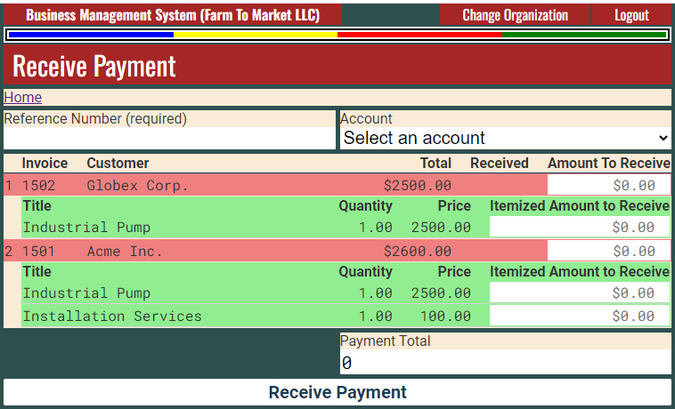
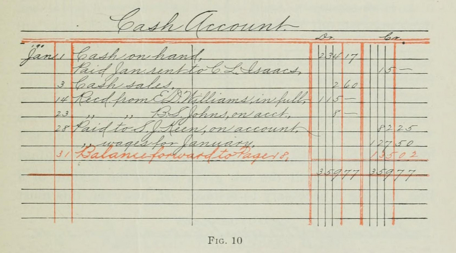

[Watch the video on YouTube](https://www.youtube.com/watch?v=MoYr0cgosOY)

## It doesn't have to be this confusing...

| Account Type        | Debit    | Credit   |
|---------------------|----------|----------|
| Assets              | Increase | Decrease |
| Liabilities         | Decrease | Increase |
| Equity/Capital      | Decrease | Increase |
| Revenue/Income      | Decrease | Increase |
| Expenses            | Increase | Decrease |

## Screenshots


---

---

---


## Introduction

GAAP and IFRS compliant implementation of a forward-only double-entry accounting method with a relational database. Suitable for U.S. and international organizations.

The only system capable of managing everything from a single laundromat to a cartel, multiple aircraft carriers, and everything in between, uncontaminated by Silicon Valley 🐂💩.

Due to its wide scope, the system is designed to be incomplete, allowing organizations to finalize the implementation.

* **Using**: C# • ASP.NET MVC • Vue.js • PostgreSQL

This solution contains example integrations of feature-specific junction tables which group the journal entries into a transaction for specific user action or feature.

A feature should be integrated with the journal if it affects one of the following account types: revenue, expense, liabilities, assets, or equity.

Since every feature that impacts the journal requires a minimum of two entries, a `TransactionGuid` column is used to group these entries together.

To implement a new feature affecting the journal, create a table to group the transaction. Prefix the table with `GeneralLedger...`, then append the names of the tables referenced by the foreign keys that appear immediately after the `GeneralLedgerId` foreign key and before the `Reversed...` column (excluding the "Id" suffix from each). For example, `GeneralLedgerInvoiceInvoiceLine` is named as such because the foreign keys after the `GeneralLedgerId` but before `Reversed...` columns are `InvoiceId` and `InvoiceLineId`. Include a `Reversed...` column to reference the entries being reversed, and a `TransactionGuid` for grouping entries. This structure supports a reversal-and-amendment strategy in a forward-only journal, where entries cannot be modified once recorded. For example, if the revenue recognition for invoice line-items needs to be adjusted after initial creation, the original entries are reversed, and new ones are added.

```sql
CREATE TABLE "GeneralLedgerInvoiceInvoiceLine"
(
	"GeneralLedgerInvoiceInvoiceLineID" SERIAL PRIMARY KEY NOT NULL,
	"GeneralLedgerId" INT NOT NULL,
	"InvoiceId" INT NOT NULL,
	"InvoiceLineId" INT NOT NULL,
	"ReversedGeneralLedgerInvoiceInvoiceLineId" INT NULL,
	"TransactionGuid" UUID NOT NULL,
	"Created" TIMESTAMPTZ NOT NULL DEFAULT (CURRENT_TIMESTAMP AT TIME ZONE 'UTC'),
	"CreatedById" INT NOT NULL,
	"OrganizationId" INT NOT NULL,
	FOREIGN KEY ("GeneralLedgerId") REFERENCES "GeneralLedger"("GeneralLedgerID"),
	FOREIGN KEY ("InvoiceId") REFERENCES "Invoice"("InvoiceID"),
	FOREIGN KEY ("InvoiceLineId") REFERENCES "InvoiceLine"("InvoiceLineID"),
	FOREIGN KEY ("ReversedGeneralLedgerInvoiceInvoiceLineId") REFERENCES "GeneralLedgerInvoiceInvoiceLine"("GeneralLedgerInvoiceInvoiceLineID"),
	FOREIGN KEY ("CreatedById") REFERENCES "User"("UserID"),
	FOREIGN KEY ("OrganizationId") REFERENCES "Organization"("OrganizationID")
);
```

This naming strategy makes it easy for developers to understand the relationship between features and the journal.

The `GeneralLedgerInvoiceInvoiceLine` is used to record entries during creation of the invoice, the modification of the line-items, and the removal of the line-items from the invoice. However, if you require these concepts to be separated even further, you could adopt a different naming strategy, for example, `GeneralLedgerInvoiceInvoiceLineCreated`, `GeneralLedgerInvoiceInvoiceLineUpdated`, `GeneralLedgerInvoiceInvoiceLineRemoved`.

For example, it may be useful to know how much revenue is lost due to line-items being removed from the invoice.

## Journal, accounts, and double-entry

```sql
CREATE TABLE "Account"
(
	"AccountID" SERIAL PRIMARY KEY NOT NULL,
	"Name" VARCHAR(200) NOT NULL,
	"Type" VARCHAR(50) NOT NULL CHECK ("Type" IN ('assets', 'liabilities', 'equity', 'revenue', 'expense')),
	-- ...
	"Created" TIMESTAMPTZ NOT NULL DEFAULT (CURRENT_TIMESTAMP AT TIME ZONE 'UTC'),
	"ParentAccountId" INT NULL,
	"CreatedById" INT NOT NULL,
	"OrganizationId" INT NOT NULL,
	FOREIGN KEY ("ParentAccountId") REFERENCES "Account"("AccountID"),
	FOREIGN KEY ("CreatedById") REFERENCES "User"("UserID"),
	FOREIGN KEY ("OrganizationId") REFERENCES "Organization"("OrganizationID"),
	UNIQUE ("Name", "OrganizationId")
);
```

The `ParentAccountId` allows for hierarchical relationships which allow for better reporting and analysis. However, ensuring that the `ParentAccountId` is of the same `Type` as the `AccountID` is enforced at application level.

```sql
CREATE TABLE "GeneralLedger"
(
	"GeneralLedgerID" SERIAL PRIMARY KEY NOT NULL,
	"AccountId" INT NOT NULL,
	"Credit" DECIMAL(20, 4) NULL,
	"Debit" DECIMAL(20, 4) NULL,
	"CurrencyCode" VARCHAR(3) NULL, 
	"ExchangeRate" DECIMAL(12, 5) NULL, 
	"Memo" TEXT NULL,
	"Created" TIMESTAMPTZ NOT NULL DEFAULT (CURRENT_TIMESTAMP AT TIME ZONE 'UTC'),
	"CreatedById" INT NOT NULL,
	"OrganizationId" INT NOT NULL,
	FOREIGN KEY ("AccountId") REFERENCES "Account"("AccountID"),
	FOREIGN KEY ("CreatedById") REFERENCES "User"("UserID"),
	FOREIGN KEY ("OrganizationId") REFERENCES "Organization"("OrganizationID")
);
```

Journal entries are made in transactions of at least two entries where the sum of credits equals debits.

Double entry is misleading because some people assume the entries of a transactions are made in pairs, or have an even number of entries.


A typical chart-of-accounts might look like...

| AccountID        | Name                          | Type       | ParentAccountId        |
|------------------|-------------------------------|------------|------------------------|
| 1                | accounts-receivable           | assets     | NULL                   |
| 2                | revenue                       | revenue    | NULL                   |
| 3                | revenue-service               | revenue    | 2                      |
| 4                | revenue-product               | revenue    | 2                      |
| 5                | cash                          | assets     | NULL                   |
| 6                | chase-9988                    | assets     | NULL                   |
| 7                | chase-9988-debit-card-2323    | assets     | 6                      |
| 8                | expense                       | expense    | NULL                   |
| 9                | expense-diesel                | expense    | 8                      |
| 10               | expense-meals                 | expense    | 8                      |
| 11               | expense-maintenance           | expense    | 8                      |
| 12               | discover-5555                 | liabilities| NULL                   |
| 13               | inventory                     | assets     | NULL                   |
| 14               | sales-tax-payable             | liabilities| NULL                   |

Keep an eye on number 14.

Consider a transaction where an invoice is created with one line-item which requires sales tax to be collected...

| GeneralLedgerID | AccountId        | Credit  | Debit   |
|-----------------|------------------|---------|---------|
| 1               | 1  (ar)          | 0.00    | 1100.00 |
| 2               | 2  (revenue)     | 1000.00 | 0.00    |
| 3               | 14 (liabilities) | 100.00  | 0.00    |

The above table shows a valid transaction made up of three entries where debits equal credits.

Examine the `TransactionGuid` column in the table below from the result of `SELECT * FROM "GeneralLedgerInvoiceInvoiceLine";` to identify transaction boundary.

|ID|GeneralLedgerId|InvoiceId|InvoiceLineId|ReversedId|TransactionGuid|
|---|---|---|---|---|---|
|1|2|1|1|NULL|e0b84e1c-e62d-60f2-0a96-61f895c14fcf|2024-06-19 22:55:38.882187-05|
|2|1|1|1|NULL|e0b84e1c-e62d-60f2-0a96-61f895c14fcf|2024-06-19 22:55:38.882187-05|
|3|4|1|2|NULL|e0b84e1c-e62d-60f2-0a96-61f895c14fcf|2024-06-19 22:55:38.882187-05|
|4|3|1|2|NULL|e0b84e1c-e62d-60f2-0a96-61f895c14fcf|2024-06-19 22:55:38.882187-05|
|5|5|1|1|1|91977936-5d6a-401b-7ea6-9092eee92918|2024-06-19 22:59:32.477332-05|
|6|6|1|1|NULL|91977936-5d6a-401b-7ea6-9092eee92918|2024-06-19 22:59:32.477332-05|
|7|7|1|1|2|91977936-5d6a-401b-7ea6-9092eee92918|2024-06-19 22:59:32.477332-05|
|8|8|1|1|NULL|91977936-5d6a-401b-7ea6-9092eee92918|2024-06-19 22:59:32.477332-05|
|9|9|1|2|3|91977936-5d6a-401b-7ea6-9092eee92918|2024-06-19 22:59:32.477332-05|
|10|10|1|2|NULL|91977936-5d6a-401b-7ea6-9092eee92918|2024-06-19 22:59:32.477332-05|
|11|11|1|2|4|91977936-5d6a-401b-7ea6-9092eee92918|2024-06-19 22:59:32.477332-05|
|12|12|1|2|NULL|91977936-5d6a-401b-7ea6-9092eee92918|2024-06-19 22:59:32.477332-05|
|13|13|1|1|6|227fa74a-3166-01b6-61db-0f6a6af4a52e|2024-06-19 23:07:32.54741-05|
|14|14|1|1|8|227fa74a-3166-01b6-61db-0f6a6af4a52e|2024-06-19 23:07:32.54741-05|

Note the reversing entries and the three separate transactions.

1. Rows 1-4 invoice with two line-items is created.
2. Rows 5-12 both line-items updated.
3. Rows 13-14 one line-item is removed.

**To prevent confusion regarding how to determine if a line-item was removed from an invoice, and without adding additional flags or columns to indicate line-item removal, the line-items whose transactions end with a reversal are considered removed from the invoice.**

## Payments

* Payments are received against invoice line-items.
* Payments can be partial.
* The relationship between payment and invoice is many-to-many.

The `GeneralLedgerInvoiceInvoiceLinePayment` links the journal entries with the payment.

```sql
CREATE TABLE "GeneralLedgerInvoiceInvoiceLinePayment"
(
  "GeneralLedgerInvoiceInvoiceLinePaymentID" SERIAL PRIMARY KEY NOT NULL,
  "GeneralLedgerId" INT NOT NULL,
  "InvoiceInvoiceLinePaymentId" INT NOT NULL,
  "ReversedGeneralLedgerInvoiceInvoiceLinePaymentId" INT NULL,
  "TransactionGuid" UUID NOT NULL,
  "Created" TIMESTAMPTZ NOT NULL DEFAULT (CURRENT_TIMESTAMP AT TIME ZONE  'UTC'),
  "CreatedById" INT NOT NULL,
  "OrganizationId" INT NOT NULL,
  FOREIGN KEY ("GeneralLedgerId") REFERENCES "GeneralLedger"  ("GeneralLedgerID"),
  FOREIGN KEY ("InvoiceInvoiceLinePaymentId") REFERENCES  "InvoiceInvoiceLinePayment"("InvoiceInvoiceLinePaymentID"),
  FOREIGN KEY ("ReversedGeneralLedgerInvoiceInvoiceLinePaymentId")  REFERENCES "GeneralLedgerInvoiceInvoiceLinePayment"  ("GeneralLedgerInvoiceInvoiceLinePaymentID"),
  FOREIGN KEY ("CreatedById") REFERENCES "User"("UserID"),
  FOREIGN KEY ("OrganizationId") REFERENCES "Organization"  ("OrganizationID")
);
```

An incoming check is usually entered into the system before it is deposited. Ideally, the check should be entered into a check-in-transit or similar asset account and later synchronized when it appears on the statement.

## Reconciliations

The pattern repeats in the `GeneralLedgerReconciliationTransaction` table. A bank or credit card statement contains rows of transactions. Credit card statements will have expense transactions while bank statements will have both expense and revenue transactions.

Each transaction in the statement should be uniquely identifiable, but often the exported CSV does not contain a column to uniquely identify the row.

```sql
CREATE TABLE "GeneralLedgerReconciliationTransaction"
(
  "GeneralLedgerReconciliationTransactionID" SERIAL PRIMARY KEY NOT NULL,
  "GeneralLedgerId" INT NOT NULL,
  "ReconciliationTransactionId" INT NOT NULL,
  "ReversedGeneralLedgerReconciliationTransactionId" INT NULL,
  "TransactionGuid" UUID NOT NULL,
  "Created" TIMESTAMPTZ NOT NULL DEFAULT (CURRENT_TIMESTAMP AT TIME ZONE  'UTC'),
  "CreatedById" INT NOT NULL,
  "OrganizationId" INT NOT NULL,
  FOREIGN KEY ("GeneralLedgerId") REFERENCES "GeneralLedger"  ("GeneralLedgerID"),
  FOREIGN KEY ("ReconciliationTransactionId") REFERENCES  "ReconciliationTransaction"("ReconciliationTransactionID"),
  FOREIGN KEY ("ReversedGeneralLedgerReconciliationTransactionId")  REFERENCES "GeneralLedgerReconciliationTransaction"  ("GeneralLedgerReconciliationTransactionID"),
  FOREIGN KEY ("CreatedById") REFERENCES "User"("UserID"),
  FOREIGN KEY ("OrganizationId") REFERENCES "Organization"  ("OrganizationID")
);
```

Integration with banks to pull the transaction data programatically is possible, but CSV import is used as universal fallback option.

## Installation

0. Have `dotnet` installed.
1. Have `psql` installed.
   1. Have `CREATE EXTENSION IF NOT EXISTS postgis;` installed.
   2. Have `CREATE EXTENSION IF NOT EXISTS pgcrypto;` installed.
2. Update connection strings in `appsettings.json`.
3. Set `database-reset.json` to `true` and run. This does two things...
   1. Uses the main database context to create the application database.
   2. Runs `create-db...` script to create tables, columns, relationships, indexes, etc. I will later separate sample data to be optional.
4. Use `test@example.com` pw `test` to login and choose "Farm To Market LLC", it already has sample chart of accounts.
5. Create invoice.
6. Receive payment.

## Backup and import/export strategy

The system will have three levels of backups.

1. **Ledger** - System will attempt to perform a backup upon every action/transaction that affects the ledger. Backups will be in human and machine readable format such as csv, json, or xml (you'll get to pick whichever you hate the least). 
2. **Database** - Performed as often as resources allow, ideally every hour.
3. **Instance** - Entire virtual machine instance is backed up daily.

---

## Ambitions of Grandeur: Rebuilding an Institution

Why doesn't anyone want to be an accountant? Because it's not accounting anymore.



I don't remember QwackBooks ever looking like that.

Intuit didn't invent accounting; they've stolen it.

Accounting existed before computers, databases, and software. Transactions were recorded in physical journals using pen and paper, which forced accountants to have a better understanding of company finances due to the process of manual entry, with little room for error. Now, the process has been automated through software, and the journal entries are hidden away, leaving only the final report to spot errors and fraud.

None of you can call yourselves accountants; you're just QwackBooks users. The truck drivers of the office. Your boss thinks of you as a whiny, tail-dragging █████. That's why he needs just one of you who knows the entire system. Maybe you'll get lucky with an assistant, but most likely they'll cause more problems, because it'll be the boss's daughter and she doesn't give a ████.

Companies that adopt my system are far less likely to get audited than those using QwackBooks or some half-baked ERP system thrown together by a committee in India and managed by another in San Francisco. These systems often go through months of customization and setup before they can be used, and still end in failed implementations.

